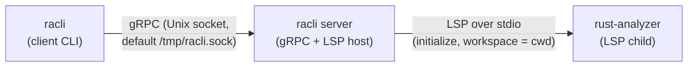

# High-level architecture

`racli` splits work between a **client** (CLI invocations that talk to the socket), a **server** (gRPC over a Unix socket plus an LSP child), and **rust-analyzer** (the actual language server).

The client only speaks gRPC to `racli server`. The server owns the `rust-analyzer` process and the LSP session for the directory where the server was started.
