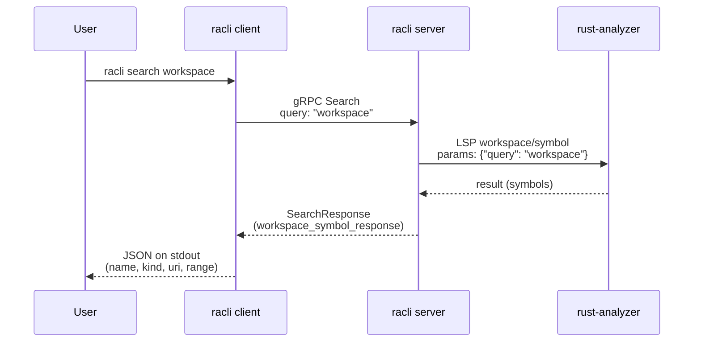
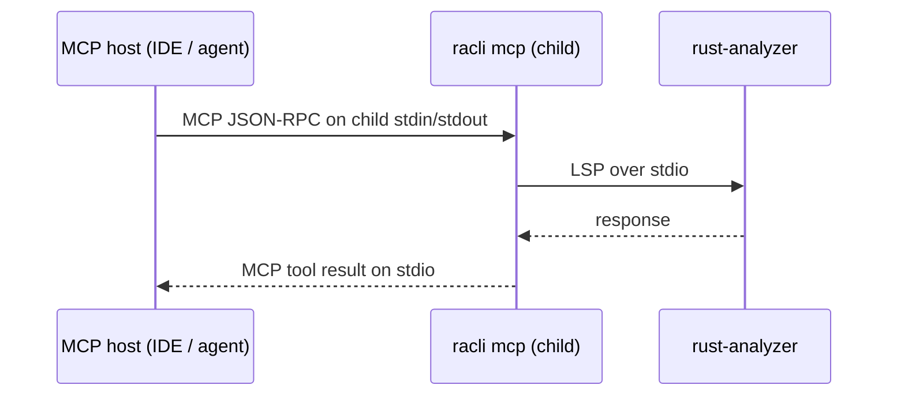

# High-level architecture

## racli server

`racli` splits work between a **client** (CLI invocations that talk to the socket), a **server** (gRPC over a Unix socket plus an LSP child), and **rust-analyzer** (the actual language server).

```mermaid
sequenceDiagram
    participant Client as racli client
    participant Server as racli server
    participant RA as rust-analyzer

    Client->>Server: request via gRPC (Unix socket, default /tmp/racli.sock)
    Server->>RA: request via LSP over stdio (initialize; workspace = server cwd)
    RA-->>Server: response
    Server-->>Client: response
```

### Example: `racli search`

For `racli search <query>` (here `racli search workspace`), the client sends gRPC **`Search`**. The server calls rust-analyzer with the LSP JSON-RPC method **`workspace/symbol`** (implemented in code as `RustAnalyzerSession::workspace_symbol`).



The client only speaks gRPC to `racli server`. The server owns the `rust-analyzer` process and the LSP session for the directory where the server was started.

## racli mcp

MCP hosts (for example **Cursor**, **Claude Desktop**, or any client that speaks the [Model Context Protocol](https://modelcontextprotocol.io)) register `racli mcp` as an MCP server **command**. When a session needs tools, the host **spawns** that command as a **child process** and drives MCP over the child’s **stdio**: framed JSON-RPC on **stdin** / **stdout**, with **stderr** available for logs.

The MCP child process **starts its own rust-analyzer session** (same LSP `initialize` / `initialized` flow and workspace file watching as `racli server`) and serves tools **in-process**. It does **not** connect to `racli server` over the Unix socket. Tool semantics match the **`Racli` gRPC** API (`GetVersion`, `Search`, `FindDefinition`) but are implemented via the same in-crate `RacliSession` logic as the gRPC server, without dialing the socket.



Configure the MCP host so the **`racli mcp` working directory** is the intended Rust workspace root (the directory you would `cd` into before running `cargo build`). **`racli server`** remains the path for CLI clients (`racli search`, `racli find-definition`, `racli version`): those commands still use gRPC on the Unix socket.
