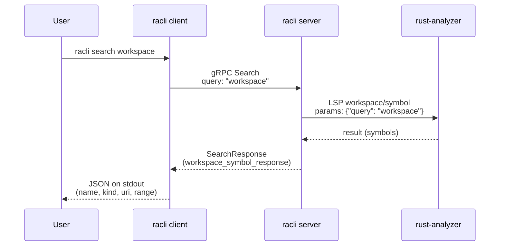

# High-level architecture

`racli` splits work between a **client** (CLI invocations that talk to the socket), a **server** (gRPC over a Unix socket plus an LSP child), and **rust-analyzer** (the actual language server).

```mermaid
sequenceDiagram
    participant Client as racli client
    participant Server as racli server
    participant RA as rust-analyzer

    Client->>Server: request → gRPC (Unix socket,<br/>default /tmp/racli.sock)
    Server->>RA: request → LSP over stdio<br/>(initialize; workspace = server cwd)
    RA-->>Server: ← response
    Server-->>Client: ← response
```

### Example: `racli search`

For `racli search <query>` (here `racli search workspace`), the client sends gRPC **`Search`**. The server calls rust-analyzer with the LSP JSON-RPC method **`workspace/symbol`** (implemented in code as `RustAnalyzerSession::workspace_symbol`).



The client only speaks gRPC to `racli server`. The server owns the `rust-analyzer` process and the LSP session for the directory where the server was started.