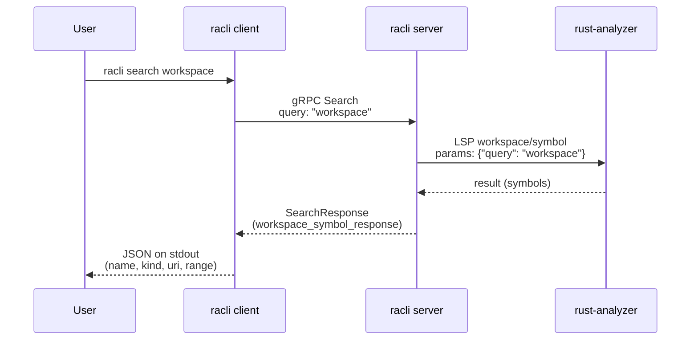
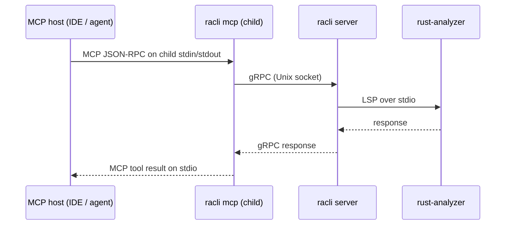

# High-level architecture

## racli server

`racli` splits work between a **client** (CLI invocations that talk to the socket), a **server** (gRPC over a Unix socket plus an LSP child), and **rust-analyzer** (the actual language server).

```mermaid
sequenceDiagram
    participant Client as racli client
    participant Server as racli server
    participant RA as rust-analyzer

    Client->>Server: request via gRPC (Unix socket, default /tmp/racli.sock)
    Server->>RA: request via LSP over stdio (initialize; workspace = server cwd)
    RA-->>Server: response
    Server-->>Client: response
```

### Example: `racli search`

For `racli search <query>` (here `racli search workspace`), the client sends gRPC **`Search`**. The server calls rust-analyzer with the LSP JSON-RPC method **`workspace/symbol`** (implemented in code as `RustAnalyzerSession::workspace_symbol`).



The client only speaks gRPC to `racli server`. The server owns the `rust-analyzer` process and the LSP session for the directory where the server was started.

## racli mcp

MCP hosts (for example **Cursor**, **Claude Desktop**, or any client that speaks the [Model Context Protocol](https://modelcontextprotocol.io)) register `racli mcp` as an MCP server **command**. When a session needs tools, the host **spawns** that command as a **child process** and drives MCP over the child’s **stdio**: framed JSON-RPC on **stdin** / **stdout**, with **stderr** available for logs. The LLM never opens the Unix socket itself; it only talks to the MCP runtime, which in turn talks to `racli mcp` on stdio.

`racli mcp` is a **thin adapter**: each MCP tool (`get_version`, `search`, `find_definition`, …) maps to the same **`Racli` gRPC** methods as the CLI (`GetVersion`, `Search`, `FindDefinition`). The MCP process **dials the running `racli server`** on the Unix domain socket (default `/tmp/racli.sock`, overridable with `RACLI_UNIX_SOCKET`) and forwards the request there. The long-lived server still owns **rust-analyzer** and LSP; MCP traffic joins **CLI traffic** on the same socket and the same analyzer session.



For workspace paths and symbol results to line up with the server, start **`racli server`** from the intended project root, then point the MCP host at `racli mcp` so tool calls hit that same server instance.
