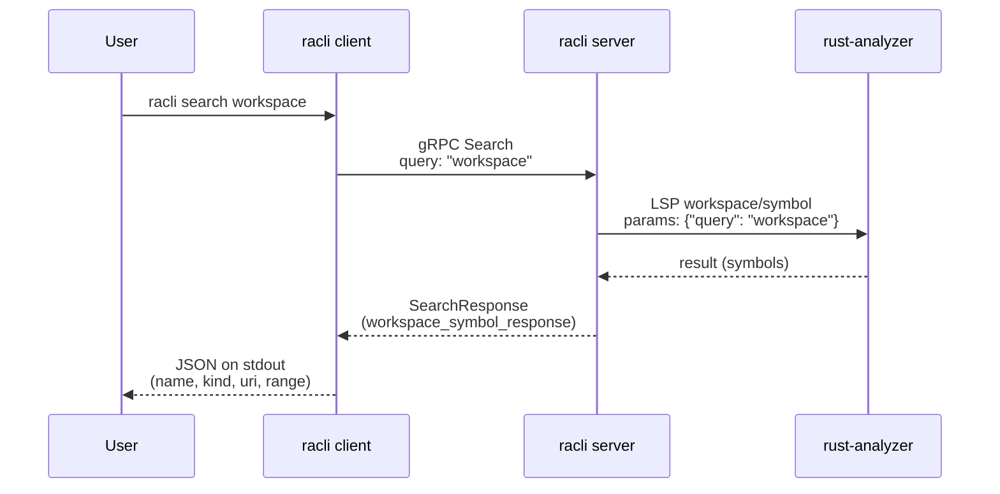
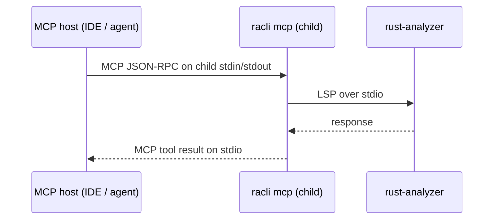
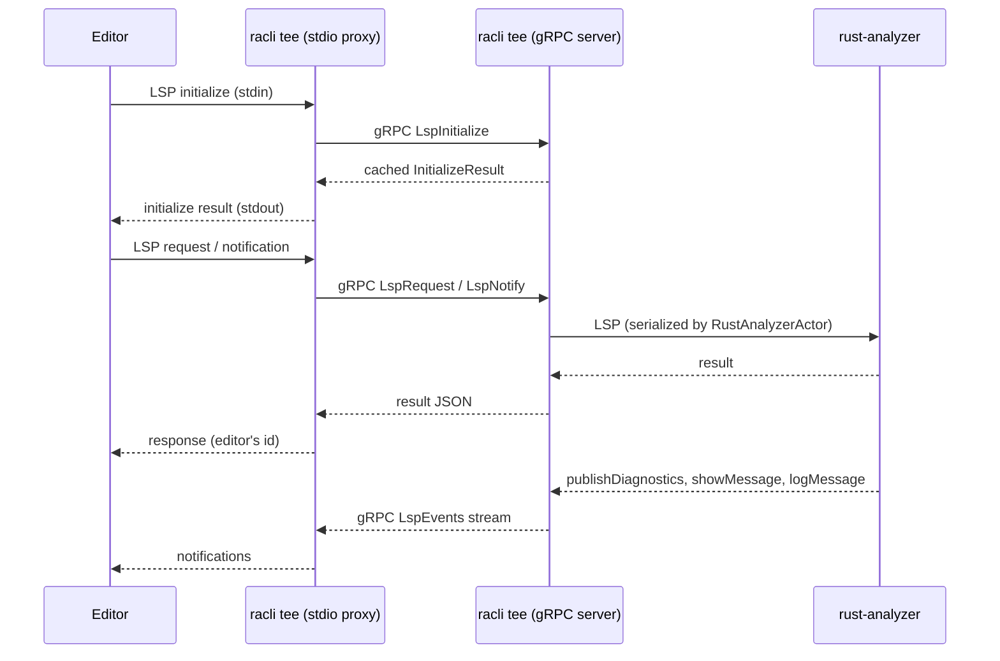
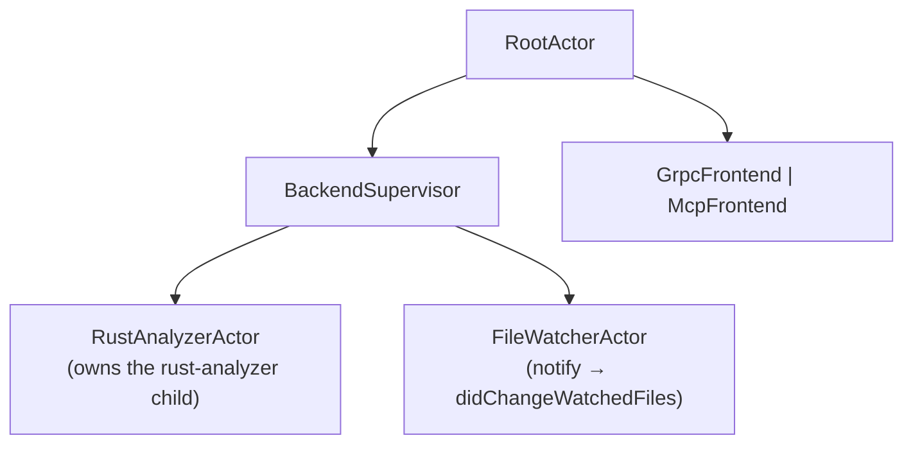

# High-level architecture

## racli server

`racli` splits work between a **client** (CLI invocations that talk to the socket), a **server** (gRPC over a Unix socket plus an LSP child), and **rust-analyzer** (the actual language server).

```mermaid
sequenceDiagram
    participant Client as racli client
    participant Server as racli server
    participant RA as rust-analyzer

    Client->>Server: request via gRPC (Unix socket, default /tmp/racli.sock)
    Server->>RA: request via LSP over stdio (initialize; workspace = server cwd)
    RA-->>Server: response
    Server-->>Client: response
```

### Example: `racli search`

For `racli search <query>` (here `racli search workspace`), the client sends gRPC **`Search`**. The server calls rust-analyzer with the LSP JSON-RPC method **`workspace/symbol`** (implemented in code as `RustAnalyzerSession::workspace_symbol`).

```mermaid
sequenceDiagram
    participant User
    participant Client as racli client
    participant Server as racli server
    participant RA as rust-analyzer

    User->>Client: racli search workspace
    Client->>Server: gRPC Search<br/>query: "workspace"
    Server->>RA: LSP workspace/symbol<br/>params: {"query": "workspace"}
    RA-->>Server: result (symbols)
    Server-->>Client: SearchResponse<br/>(workspace_symbol_response)
    Client-->>User: JSON on stdout<br/>(name, kind, uri, range)
```

The client only speaks gRPC to `racli server`. The server owns the `rust-analyzer` process and the LSP session for the directory where the server was started.

## racli mcp

MCP hosts (for example **Cursor**, **Claude Desktop**, or any client that speaks the [Model Context Protocol](https://modelcontextprotocol.io)) register `racli mcp` as an MCP server **command**. When a session needs tools, the host **spawns** that command as a **child process** and drives MCP over the child’s **stdio**: framed JSON-RPC on **stdin** / **stdout**, with **stderr** available for logs.

The MCP child process **starts its own rust-analyzer session** (same LSP `initialize` / `initialized` flow and workspace file watching as `racli server`) and serves tools **in-process**. It does **not** connect to `racli server` over the Unix socket. Tool semantics match the **`Racli` gRPC** API (`GetVersion`, `Search`, `FindDefinition`) but are implemented via the same in-crate `RacliSession` logic as the gRPC server, without dialing the socket.

```mermaid
sequenceDiagram
    participant Host as MCP host (IDE / agent)
    participant Mcp as racli mcp (child)
    participant RA as rust-analyzer

    Host->>Mcp: MCP JSON-RPC on child stdin/stdout
    Mcp->>RA: LSP over stdio
    RA-->>Mcp: response
    Mcp-->>Host: MCP tool result on stdio
```

Configure the MCP host so the **`racli mcp` working directory** is the intended Rust workspace root (the directory you would `cd` into before running `cargo build`). **`racli server`** remains the path for CLI clients (`racli search`, `racli find-definition`, `racli version`): those commands still use gRPC on the Unix socket.

## racli tee

`racli tee` runs the `racli server` actor tree in-process and also serves LSP on stdio for an editor. The stdio proxy is an ordinary gRPC client of the socket, so editor traffic goes through the same `RustAnalyzerActor` mailbox as every other client.

```mermaid
sequenceDiagram
    participant Editor
    participant Tee as racli tee (stdio proxy)
    participant Server as racli tee (gRPC server)
    participant RA as rust-analyzer

    Editor->>Tee: LSP initialize (stdin)
    Tee->>Server: gRPC LspInitialize
    Server-->>Tee: cached InitializeResult
    Tee-->>Editor: initialize result (stdout)
    Editor->>Tee: LSP request / notification
    Tee->>Server: gRPC LspRequest / LspNotify
    Server->>RA: LSP (serialized by RustAnalyzerActor)
    RA-->>Server: result
    Server-->>Tee: result JSON
    Tee-->>Editor: response (editor's id)
    RA-->>Server: publishDiagnostics, showMessage, logMessage
    Server-->>Tee: gRPC LspEvents stream
    Tee-->>Editor: notifications
```

The editor's `shutdown` is acknowledged locally, and `exit` (or stdin EOF) shuts the whole tree down.

## Internal actor tree

Inside `racli server` and `racli mcp`, long-lived work is supervised by [ractor](https://docs.rs/ractor) actors (`src/actors/`):

```mermaid
flowchart TD
    Root[RootActor] --> Backend[BackendSupervisor]
    Root --> Frontend["GrpcFrontend | McpFrontend"]
    Backend --> RA["RustAnalyzerActor<br/>(owns the rust-analyzer child)"]
    Backend --> Watcher["FileWatcherActor<br/>(notify → didChangeWatchedFiles)"]
```

- **Startup:** rust-analyzer is spawned and LSP-initialized, then the file watcher starts, then the front end binds the Unix socket (gRPC) or completes the MCP handshake. A failure at any step tears down what already started.
- **Requests:** gRPC/MCP handlers call `RacliSession`, which sends messages to `RustAnalyzerActor`; its mailbox serializes LSP traffic.
- **Shutdown** (SIGINT/SIGTERM, gRPC serve error, or MCP stdin EOF) runs in reverse: front end → file watcher (queued events drained) → rust-analyzer (`shutdown`/`exit`, then wait for the child).
- **Failures:** a crashed backend actor is logged, not restarted; later requests fail with an `Internal` error.
